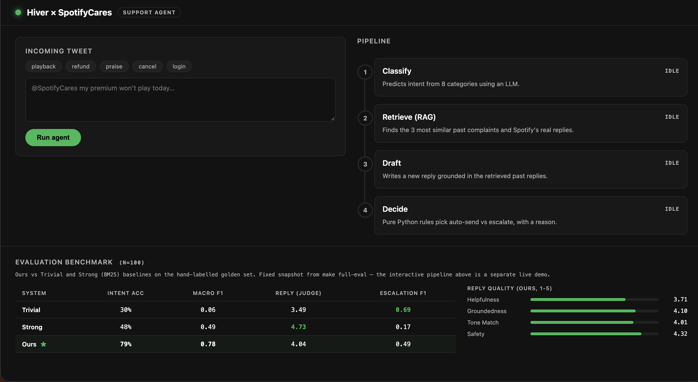
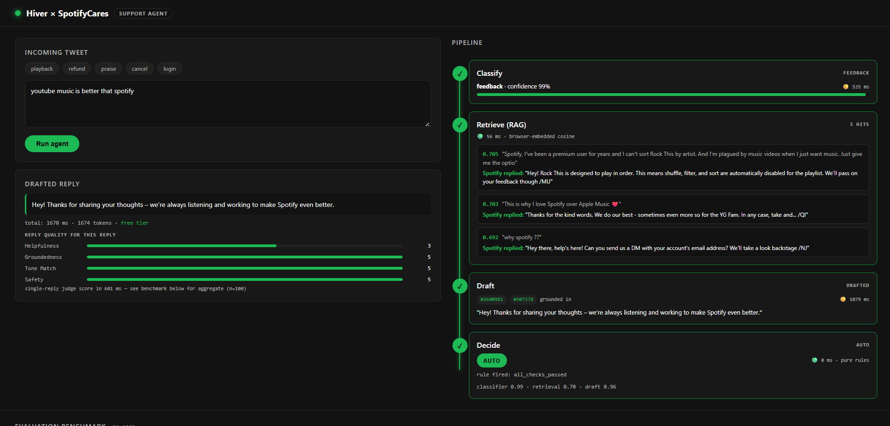

# Hiver Support Agent — SpotifyCares

Take-home for the Hiver SDE Intern application. A Python service that classifies incoming customer tweets, drafts replies grounded in Spotify's real historical support conversations (RAG), and decides whether to auto-send or escalate to a human.

**Author:** Atharv Tripathi

## Headline results

Evaluation was run on **n=100** subset of the 200-tweet golden set. Full
golden set is committed. See `REPORT.md` §6 and §7 for the details.

| System        | Intent Acc | Intent macro-F1 | Reply (judge 1-5) | Escalation F1 | Cost / 1k | P50 latency |
|---------------|-----------:|----------------:|------------------:|--------------:|----------:|------------:|
| Trivial       |       0.30 |            0.06 |              3.49 |          0.69 |     \$0.00 |      ~5 ms  |
| Strong (BM25) |       0.48 |            0.49 |              4.73 |          0.17 |     \$0.00 |     ~40 ms  |
| Ours          |   **0.79** |        **0.78** |              4.04 |          0.49 | free tier |   ≈8400 ms  |

Latency cells: trivial/strong are local approximations (no network
calls). Ours derives from `eval/results/cost_latency.json`: two
`gpt-oss-120b` calls per decision at p50 4219 ms each. Details in
REPORT.md §10.

Ours leads on intent classification by 31 points on Intent Acc and 29
points on Macro-F1 versus the Strong (BM25) baseline. Strong is ahead on
Reply (judge) because its reply is Spotify's real past reply reused
verbatim; that column's caveat is discussed in REPORT §7. Trivial's
Escalation F1 lead comes from always escalating, which maxes recall on
the `should_escalate=true` class at the cost of any precision.

Judge-vs-human Cohen's κ (50 blind ratings I did myself, quadratic weighted):
tone_match 0.73, helpfulness 0.61, groundedness 0.34, safety 0.00 (ceiling
effect: both raters at 5 on nearly every reply). Full breakdown in
REPORT.md §9.

Full results in `eval/results/headline.md` and `eval/results/headline.json`.
Confusion matrix in `eval/results/confusion.json`. Cost + latency
breakdown in `eval/results/cost_latency.json`.

## Live demo

Deployed at **https://spotifycares.onrender.com** (Render free tier. The
service cold-starts after ~15 min idle; the UI shows a status pill while
the backend wakes. On the first agent run the browser downloads the
MiniLM embedding model once (~90 MB). The server does pure numpy search,
so it stays under the 512 MB free-tier memory limit.)

## Reproduce in <15 minutes

Prereqs: Python 3.12+, ~2 GB free disk.

### 1. Get a Groq API key (free)

- Groq — https://console.groq.com/keys → new key → `GROQ_API_KEY`

```bash
# macOS / Linux
cp .env.example .env
# Windows PowerShell
copy .env.example .env
# then open .env, paste your GROQ_API_KEY, save
```

### 2. Get the dataset (177 MB from Kaggle)

The raw dataset is not committed (~493 MB unzipped). Only needed if you
want to regenerate `data/processed/*` from scratch. The processed artifacts
that `make demo` needs are already committed.

- https://www.kaggle.com/datasets/thoughtvector/customer-support-on-twitter → Download → unzip
- Move `twcs.csv` into `data/raw/twcs.csv`

Or via Kaggle CLI:

```bash
# macOS / Linux — put ~/.kaggle/kaggle.json in place first
pip install kaggle
kaggle datasets download -d thoughtvector/customer-support-on-twitter -p data/raw --unzip
mv data/raw/twcs/twcs.csv data/raw/twcs.csv
```

```powershell
# Windows PowerShell — put %USERPROFILE%\.kaggle\kaggle.json in place first
pip install kaggle
kaggle datasets download -d thoughtvector/customer-support-on-twitter -p data\raw --unzip
Move-Item data\raw\twcs\twcs.csv data\raw\twcs.csv
```

### 3. Install and run

**macOS / Linux (with `make`):**

```bash
make setup       # creates .venv, installs deps, prepares data dirs
make check-llm   # smoke-tests the Groq client
make demo        # runs eval on 20 golden tweets, prints headline table
```

**Windows PowerShell (no `make` needed):**

```powershell
py -3.12 -m venv .venv
.\.venv\Scripts\Activate.ps1
python -m pip install -U pip
python -m pip install -r requirements.txt
New-Item -ItemType Directory -Force -Path data\raw, data\processed, data\golden, eval\results | Out-Null

python -m src.llm                     # smoke-tests the Groq client
python -m eval.run_eval --subset 20   # equivalent of "make demo"
```

**Windows Command Prompt (cmd.exe):**

```bat
py -3.12 -m venv .venv
.venv\Scripts\activate.bat
python -m pip install -U pip
python -m pip install -r requirements.txt
mkdir data\raw data\processed data\golden eval\results

python -m src.llm
python -m eval.run_eval --subset 20
```

### 4. Full pipeline (only needed if you want to regenerate `data/processed/*`)

The processed files are committed for reproducibility, so `make demo`
works from a fresh clone. Only run this section if you want to
regenerate them (works identically on macOS, Linux, and Windows once
the venv is activated):

```bash
python -m src.ingest              # twcs.csv → data/processed/threads.parquet
python -m src.intents             # cluster + label all 40,834 threads with 8 intents
python -m src.retrieve            # build data/processed/retrieval_index.npz (numpy)
python -m eval.run_eval           # full eval on the golden set → eval/results/*
```

### 4b. Larger eval sample

`make demo` runs on `--subset 20`. To run the same n=100 the report is
based on:

```bash
python -m eval.run_eval --subset 100
```

Note: n≥100 may hit Groq's free-tier daily token cap on the judge model.
`eval/run_eval.py` handles this by truncating all systems to the smallest
completed multiple of 10, so the run always finishes with all systems
scored on the same set of tweets.

### 5. Live demo UI (optional)

```bash
# macOS / Linux
make ui           # or:  python serve.py

# Windows (both PowerShell and cmd)
python serve.py
```

Then open http://127.0.0.1:8000 for the Spotify-styled pipeline visualisation.

## Design

Four stages per tweet, two of which call an LLM:

1. **Classify** — GPT-OSS 120B via Groq returns `{intent, confidence}`.
2. **Retrieve** — local cosine similarity (numpy) over ~40k past (customer, brand-reply) pairs, intent-filtered, top-3.
3. **Draft** — GPT-OSS 120B writes a reply grounded in the retrieved pairs and cites which retrieved thread IDs it drew from.
4. **Decide** — deterministic Python rules pick auto vs escalate. Rules include: low classifier confidence, low retrieval similarity, and a regex over sensitive keywords (refund / legal / hack / minor / threat).

Judge is `openai/gpt-oss-20b` on Groq, a smaller model than the drafter
(`gpt-oss-120b`). Both are OpenAI open-weights so the family is shared;
what this means for reply-quality scores is discussed in REPORT §7 and §9,
where the judge is validated against 50 blind human ratings.

Embeddings are `sentence-transformers/all-MiniLM-L6-v2` (384-dim). In the
hosted demo the same model runs **in-browser** via
`@huggingface/transformers`, so the web server stays a thin numpy
cosine-search service and never imports torch. That's what keeps it under
Render's 512 MB free-tier limit. The CLI/eval path still embeds locally
with the full `sentence-transformers` package. Retrieval is `numpy` cosine
similarity over the ~40k embedding matrix. A vector database is not needed
at this scale.

Every LLM call is cached to `data/processed/llm_cache.sqlite` keyed on `SHA256(provider|model|prompt|schema)`, so `make demo` reproduces the same numbers across runs and iteration is free after the first pass.

## Deliverables (per assignment)

| deliverable | file | notes |
|---|---|---|
| Runnable pipeline | `Makefile`, `run.py`, `src/`, `eval/` | `make demo` in <15 min on fresh clone |
| Golden set | `data/golden/golden_set.jsonl` | 200 hand-labelled examples |
| Sampling notes | `data/golden/sampling_notes.md` | how the 200 were picked + labelling rubric |
| Automated metrics | `eval/metrics.py`, `eval/results/headline.md` + `.json`, `eval/results/confusion.json` | Intent Acc, Macro-F1, Escalation P/R/F1, confusion matrix |
| LLM-as-judge rubric | `eval/judge.py` (rubric with anchored 1/3/5 examples per dimension) | scores helpfulness / groundedness / tone_match / safety, 1-5 each |
| Judge-vs-human agreement | `eval/results/human_ratings.jsonl` + `eval/results/judge_validation.json` | 50 blind human ratings + Cohen's κ per dimension |
| Report | `REPORT.md` | 12 sections including mandatory "misleading headline" (§7) |
| Decision log | `DECISION_LOG.md` | 15 non-obvious trade-offs with the cost of each |
| Cost + latency | `eval/results/cost_latency.json` | per-model tokens, p50/p95 latency, cost/1k decisions |

## Interactive demo

`make ui` (macOS/Linux) or `python serve.py` (any OS) starts a FastAPI server
plus a Spotify-themed static UI at http://127.0.0.1:8000. The pipeline runs
the four stages sequentially (four dedicated endpoints), animates through a
checkpoint-style rail, and shows the real retrieved past tweets and Spotify
replies so grounding is visible, not implied.

The bottom-of-page "Evaluation benchmark" panel loads batch-evaluation
results from `eval/results/headline.json`, so the UI shows the same numbers
the CLI does. No drift.

Idle state: sample-tweet chips, the pipeline rail waiting to run, and the
n=100 benchmark table pinned at the bottom.



After clicking Run agent, each pipeline stage lights up sequentially. The
retrieved past complaints and Spotify's real replies appear inline. The
drafted reply shows its `grounded_in` citations. The decide step shows
the exact rule that fired.



## Citations / borrowed components

- **Dataset:** `thoughtvector/customer-support-on-twitter` from Kaggle
  (~3M tweets, CC-BY-NC-SA-4.0). Filtered to `SpotifyCares` in
  `src/ingest.py`.
- **Embeddings:** `sentence-transformers/all-MiniLM-L6-v2` (Apache-2.0),
  384-dim, run locally on CPU.
- **LLMs (hosted on Groq's free tier):** `openai/gpt-oss-120b` for
  classify/draft, `openai/gpt-oss-20b` for judge. Both are OpenAI's
  open-weights models (Apache-2.0).
- **Libraries:** `pandas`, `numpy`, `scikit-learn` (KMeans + F1 metrics),
  `rank_bm25` (BM25Okapi for the strong baseline), `groq` SDK,
  `python-dotenv`, `tqdm`, `pytest`, `fastapi` + `uvicorn` (for the demo
  UI).
- **AI coding assistance:** Claude Code (Anthropic) was used during
  development for code drafting, debugging, and this README structure.
  Every line was reviewed and edited by hand.

## License

MIT.

